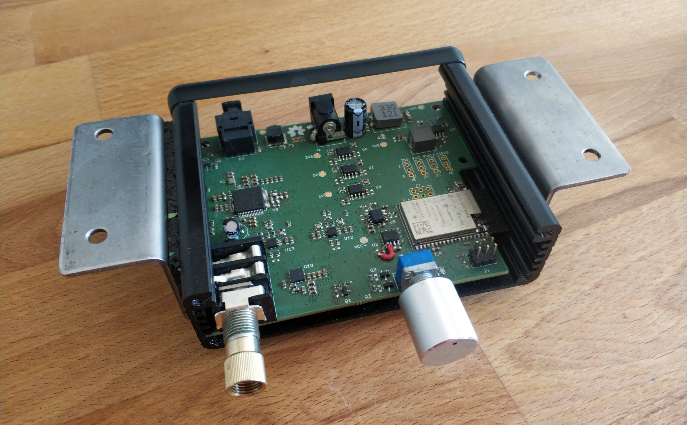

# ample
Custom headphone amplifier with optical s/pdif input.

## Features
| category | features                                                                       |
|----------|--------------------------------------------------------------------------------|
| output   | class H Headphone output                                                       |
| input    | optical S/PDIF (Toslink connector)                                             |
| supply   | 12 VDC                                                                         |

## Hardware
Hardware source files can be found in the src/hardware directory. There are KiCAD design files as well as Gerber and PDF outputs of the current revision.

### KiCad libraries used
1. [LNIC KiCAD Libraries](https://github.com/LateNightIceCream/LNIC-kicad-libraries)
